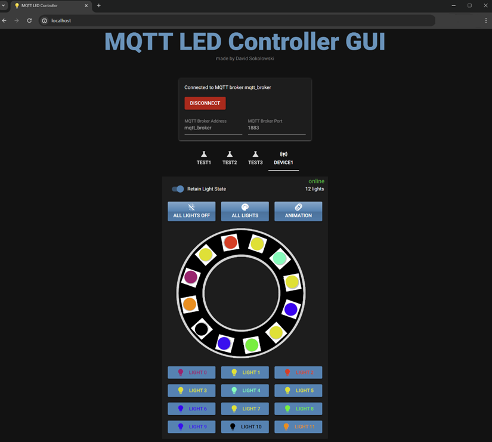

# MQTT LED Controller GUI

## Overview

This project is a user interface for controlling LEDs using MQTT (Message Queuing Telemetry Transport) protocol. It allows users to remotely control the state and color of LEDs connected to an MQTT broker.

This project is designed to work with the following ESP-32 LED controller:
[https://github.com/GitSoks/esp32_led_strip_mqtt_client](https://github.com/GitSoks/esp32_led_strip_mqtt_client)

## Table of Contents

- [MQTT LED Controller GUI](#mqtt-led-controller-gui)
  - [Overview](#overview)
  - [Table of Contents](#table-of-contents)
  - [Introduction](#introduction)
  - [Features](#features)
  - [Data Flow Diagram](#data-flow-diagram)
  - [Getting Started](#getting-started)
    - [Dependencies](#dependencies)
    - [Installation](#installation)
      - [Option 1: Using Docker with an included MQTT Broker](#option-1-using-docker-with-an-included-mqtt-broker)
      - [Option 2: Using a local python environment with a custom MQTT broker](#option-2-using-a-local-python-environment-with-a-custom-mqtt-broker)
    - [Configuration](#configuration)
    - [Usage](#usage)
  - [Acknowledgments and Resources](#acknowledgments-and-resources)
  - [Sources for used media](#sources-for-used-media)
  - [Contact](#contact)

## Introduction

The MQTT LED Controller UI is a web-based application built with Python. It provides a user-friendly interface for controlling LEDs connected to an MQTT broker.

<div style="display:flex">

<video src="media/showcase_video.mp4" controls title="Showcase example video"  height="800px"></video>
</div>

<p align="right">(<a href="#readme-top">back to top</a>)</p>

## Features

- Connect to an MQTT broker and subscribe to LED control topics.
- Display the current state and color of the LEDs.
- Allow users to toggle the state of the LEDs (on/off).
- Allow users to change the color of the LEDs using a color picker.
- Publish MQTT messages to control the LEDs.
- Automatic and dynamic UI updates based on MQTT messages and connected devices.
- List connected devices and allow users to select a device to control.
- Option to Dockerize the application with an included MQTT broker.

<p align="right">(<a href="#readme-top">back to top</a>)</p>

## Data Flow Diagram

The following diagram shows an example of how the MQTT LED Controller UI can be used to control LEDs connected to an MQTT broker.
It also shows how the MQTT LED Controller UI can be used to control multiple devices and users, and how the UI updates dynamically based on MQTT messages.


<p align="right">(<a href="#readme-top">back to top</a>)</p>

<!-- ## Project Structure

```
mqtt_led_controller_ui
├─ .gitignore
├─ .vscode
│  ├─ launch.json
│  └─ settings.json
├─ Dockerfile
├─ docker-compose.yaml
├─ media
│  ├─ gui_readme_showcase.png
│  └─ led_ring.png
├─ mosquitto_mqtt_broker
│  ├─ config
│  │  ├─ mosquitto.conf
│  │  └─ password.txt
│  └─ log
│     └─ .gitkeep
├─ mqtt_led_controller_ui
│  ├─ device_manager.py
│  ├─ main.py
│  ├─ media
│  │  └─ led_ring.png
│  ├─ mqtt_controller.py
│  ├─ settings.py
│  └─ ui_elements.py
├─ readme.md
└─ requirements.txt

<p align="right">(<a href="#readme-top">back to top</a>)</p>

``` -->

## Getting Started

### Dependencies

Take a look at the [requirements.txt](requirements.txt) file for all dependencies.

The following third party Python packages are used in this project:

- [NiceGui](https://nicegui.io/) - A Python library for building web-based GUIs.
- [Paho MQTT](https://pypi.org/project/paho-mqtt/) - A Python MQTT client library.

You may also need to install docker and docker-compose on your machine to run the docker-compose.yaml file and the included MQTT broker.

<p align="right">(<a href="#readme-top">back to top</a>)</p>

### Installation

#### Option 1: Using Docker with an included MQTT Broker

(skip this step if you want to use the GUI in a local python environment)

1. Clone the repository:

    ```bash
    git clone https://github.com/your-username/mqtt-led-controller-ui.git
    ```

2. install docker on your machine

3. compose up the docker compose file (docker-compose.yaml):

    ```bash
    docker compose up
    ```

4. Open the application in your web browser:

    ```
    http://localhost:8080
    ```

#### Option 2: Using a local python environment with a custom MQTT broker

1. Clone the repository:

    ```bash
    git clone https://github.com/your-username/mqtt-led-controller-ui.git
    ```

2. install python (>= 3.10)

3. Install all python dependencies

    ```python
    pip install -r requirements.txt
    ```

4. Start the application:

    ```python
    python mqtt_led_controller_ui/main.py
    ```

5. Open the application in your web browser:

    ```
    http://localhost:8080
    ```

<p align="right">(<a href="#readme-top">back to top</a>)</p>

### Configuration

The MQTT LED Controller UI can be configured by modifying the [settings.py](mqtt_led_controller_ui/settings.py) file. This file contains the following settings:

- `mqttBrokerUrl`: The URL of the MQTT broker.
- `mqttUsername`: The username for connecting to the MQTT broker (optional).
- `mqttPassword`: The password for connecting to the MQTT broker (optional).
- `ledStateTopic`: The MQTT topic for subscribing to LED state updates.
- `ledColorTopic`: The MQTT topic for subscribing to LED color updates.
- `ledControlTopic`: The MQTT topic for publishing LED control messages.

<p align="right">(<a href="#readme-top">back to top</a>)</p>

### Usage

1. Launch the application in your web browser.

2. Connect to the MQTT broker by entering the required credentials.

3. Once connected, the application will display the current state and color of the LEDs.

4. Toggle the state of the LEDs by clicking the "On" or "Off" button.

5. Change the color of the LEDs by selecting a color from the color picker.

6. The application will publish MQTT messages to control the LEDs based on user actions.

<p align="right">(<a href="#readme-top">back to top</a>)</p>

## Acknowledgments and Resources

Here are some resources that I found helpful while working on this project:

- [NiceGui](https://nicegui.io/) - A Python library for building web-based GUIs.
- [Mosquitto](https://mosquitto.org/) - An open source MQTT broker.
- [MQTT Explorer](http://mqtt-explorer.com/) - A useful tool for exploring MQTT brokers.
- [MQTT Essentials](https://www.hivemq.com/mqtt-essentials/) - A great introduction to MQTT.
- [Paho MQTT](https://pypi.org/project/paho-mqtt/) - A Python MQTT client library.
- [docker-compose](https://docs.docker.com/compose/) - A tool for defining and running multi-container Docker applications.

<p align="right">(<a href="#readme-top">back to top</a>)</p>

## Sources for used media

- [led_ring.png](media/led_ring.png): [https://www.az-delivery.de](https://www.az-delivery.de/cdn/shop/products/led-ring-5v-rgb-ws2812b-12-bit-50mm-942438.jpg?v=1679398919&width=1200)

## Contact

David - [GitSoks on GitHub](Github.com/GitSoks)

Project Link: [https://github.com/GitSoks/mqtt-led-controller-ui](https://github.com/GitSoks/mqtt-led-controller-ui)

<p align="right">(<a href="#readme-top">back to top</a>)</p>

<!--
## License

To be determined.

 Distributed under the MIT License. See `LICENSE` for more information. -->
