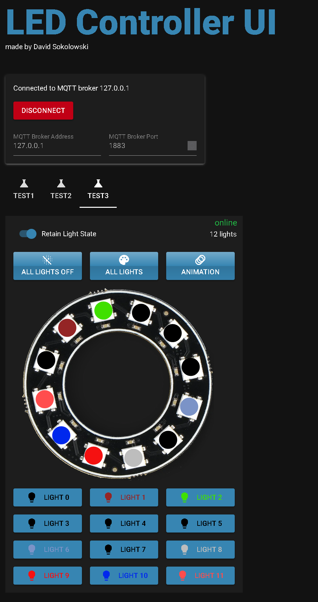

# MQTT LED Controller UI

This project is a user interface for controlling LEDs using MQTT (Message Queuing Telemetry Transport) protocol. It allows users to remotely control the state and color of LEDs connected to an MQTT broker.

This project is designed to work with the following ESP-32 LED controller:
[https://github.com/GitSoks/esp32_led_strip_mqtt_client](https://github.com/GitSoks/esp32_led_strip_mqtt_client)

## Table of Contents

- [Introduction](#introduction)
- [Features](#features)
- [Installation](#installation)
- [Usage](#usage)
- [Configuration](#configuration)
- [Contributing](#contributing)

## Introduction

The MQTT LED Controller UI is a web-based application built with Python. It provides a user-friendly interface for controlling LEDs connected to an MQTT broker.



## Features

- Connect to an MQTT broker and subscribe to LED control topics.
- Display the current state and color of the LEDs.
- Allow users to toggle the state of the LEDs (on/off).
- Allow users to change the color of the LEDs using a color picker.
- Publish MQTT messages to control the LEDs.

## Installation


### Option 1: Using Docker with an included MQTT Broker 
( skip this step if you want the use the GUI in a local python environment )

1. Clone the repository:

    ```bash
    git clone https://github.com/your-username/mqtt-led-controller-ui.git
    ```


2. install docke on you machine

3. compose up the docker compose file (docker-compose.yaml):

    ```bash
    docker-compose up
    ```

4. Open the application in your web browser:

    ```
    http://localhost:8080
    ```

### Option 2: Using a local python environment with a custom MQTT broker

1. Clone the repository:

    ```bash
    git clone https://github.com/your-username/mqtt-led-controller-ui.git
    ```


2. install python (>= 3.10)


3. Install all python dependencies

    ```python
    pip install -r requirements.txt
    ```


4. Start the application:

    ```python
    python mqtt_led_controller_ui/main.py
    ```

5. Open the application in your web browser:

    ```
    http://localhost:8080
    ```

## Usage

1. Launch the application in your web browser.

2. Connect to the MQTT broker by entering the required credentials.

3. Once connected, the application will display the current state and color of the LEDs.

4. Toggle the state of the LEDs by clicking the "On" or "Off" button.

5. Change the color of the LEDs by selecting a color from the color picker.

6. The application will publish MQTT messages to control the LEDs based on user actions.

## Configuration

The MQTT LED Controller UI can be configured by modifying the `settings.py` file. This file contains the following settings:

- `mqttBrokerUrl`: The URL of the MQTT broker.
- `mqttUsername`: The username for connecting to the MQTT broker (optional).
- `mqttPassword`: The password for connecting to the MQTT broker (optional).
- `ledStateTopic`: The MQTT topic for subscribing to LED state updates.
- `ledColorTopic`: The MQTT topic for subscribing to LED color updates.
- `ledControlTopic`: The MQTT topic for publishing LED control messages.
